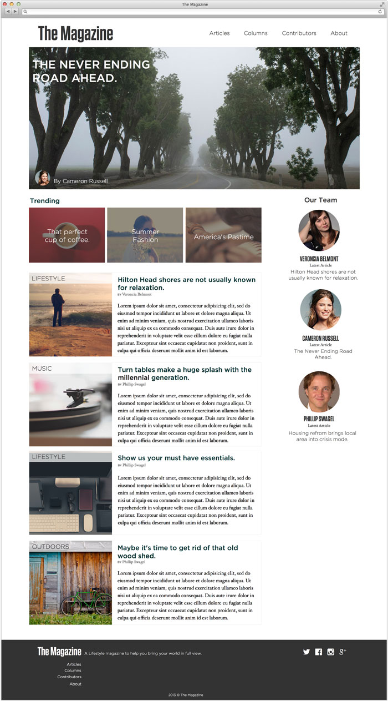

The Magazine 
============

Prototype mockup of the TheMagazine Layout.  This online magazine layout helps contributors organize their articles in a traditional blog format with a list of most recent articles.  A sidebar for team members is displayed on the left so that users can view who is contributing to the content.  The hero image is the lead feature article that  is currently trending with a small caption for the author.

## How to run this Magazine Layout Demo 

1. download/install [node.js](http://nodejs.org)
1. download/install [git](http://git-scm.com/)
1. clone this repo with git: `git clone https://github.com/slhernandez/TheMagazinePrototype.git`
1. go into the directory that was created by git: `cd TheMagazinePrototype`
1. install dependencies with npm: `npm i`
1. run it: `node app.js`
1. open http://localhost:5001 in a browser

